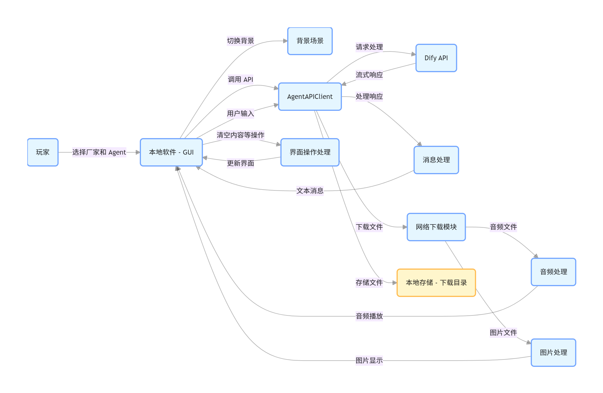

# AgentFromPku用户手册

## 一、项目简介
AgentFromPku 是一个可以让用户在虚拟的北大（PKU）里与几个智能体进行对话的项目，用户能够体验赛博游北大的乐趣。整个 AI 的调整是在 Dify 平台上完成的。

## 二、项目部署与启动
### 2.1 方式一：仓库克隆方式
clone完成后，把config.json放到main.py的统计目录下，运行main.py

### 2.2 方式二：release下载
下载好 `AgentFromPku.zip` 之后进行解压,
打开 `main.exe` 文件，稍后会出现终端，再稍后会出现主界面，请耐心等待。

## 三、项目功能概述
### 3.1 输入与输出
- **接受输入**：用户在右下角输入文本的部分填写想和智能体交流的内容。
- **输出类型**：支持文本、图片、音频三种输出类型。不过在本地只能输出文本，程序会将文本调整成其他格式。
    - **文本处理**：调用 ds 进行处理。
    - **图片处理**：调用硅基流动进行处理。
    - **音频处理**：调用 fishaudio 进行处理。

### 3.2 智能体功能
每个智能体都有各自的功能，并且支持切换地点，具体如下：
| 智能体 | 功能 |
| ---- | ---- |
| 派蒙 | 画画、语音输出 |
| nyw | 语音输出 |
| 朱光潜 | 语音输出 |
| 塞万提斯之魂 | 作诗输出 |

### 3.3 地点切换
在输入框中输入表明自己想去别的场景的内容，如“我想去###”“去###”之类的，便会自动切换到其他场景，并改变正在对话的智能体。地点对应智能体信息如下：
- 初始地点：派蒙（之后切换不回来）
- 燕南园：朱光潜
- 勺园：塞万提斯
- 未名湖：nyw

### 3.4 输出控制
通过输入的文本可以控制智能体的输出：
- **正常对话**：智能体会输出正常文本回复。
- **语音输出**：输入“想听你的声音”“用语音回复”，智能体会输出语音，并且支持暂停和继续播放。
- **图片输出**：输入“做一幅画”，智能体会输出一幅画（较为简陋，画风单一）。
- **作诗输出**：输入相关内容，塞万提斯之魂会输出一首诗，其他智能体也可以尝试。

### 3.5 响应时间
由于用户的请求需要上传到 Dify 网站上让智能体进行处理，所以会有一定的反应时间，实测 30s 内会有回应，如果 30s 还没有响应，请等待 1min，总之请耐心等待。

## 四、Dify 平台相关信息
### 4.1 平台搭建
#### 4.1.1 环境准备
- **联机官网使用**：若已挂梯子，可直接访问 Dify 官网进行使用。
- **本地部署方案**：无梯子时，可通过 Docker 在本地部署。搭建完成后导出 dsl，上传至官网后调用 API。需要注意的是，本地部署的 Agent 无法通过 API 调用。

#### 4.1.2 DSL 搭建与配置
- **DSL 资源**：已上传至 GitHub。
- **搭建逻辑**：各环节可选择 AI 的输入/输出类型，形成流水线式处理流程，用户输入沿线路依次处理。
- **Dify 使用基础步骤**：
    1. 配置模型：在 Dify 上安装并配置模型（设置→模型）。
    2. 配置工具插件：使用时按需配置。

### 4.2 调用 API 方式
- **获取 API 信息**：通过硬编码、环境配置获取 API key，硬编码 base url。代码具有一定的鲁棒性，若未获取到 key，会提示手动输入。
- **输入内容**：均为文本。
- **输出文件处理**：
    - 输出文件时返回文件名称和网址（本地无法直接调用）。
    - 程序处理逻辑：
        1. 输出提示（如“[音频]”）。
        2. 切换输出目标至标准输出。
        3. 提取 http 网址下载文件（音频自动重命名为 `.mp3`，图片无需处理）。
        4. 下载路径：程序同级目录下的 `/downloads` 文件夹（自动创建）。
        5. 返回“▶播放”按钮，支持播放/暂停操控。

## 五、代码文件说明
- `main.py`：主文件，负责初始化程序环境、创建 API 客户端和 GUI 界面。
- `gui.py`：绘制 UI，集成了以下的三个文件。
- `ui_builder.py`：负责总体 UI 界面的绘制。
- `scene_switcher.py`：用于切换场景与对应 API。
- `stream_handler.py`：用于处理流式响应（包括 UI 变化）。
- `api_client.py`：调用 API。

## 六、注意事项
- nyw_agent 虽为 nyw 本人搭建，但它并不代表 nyw，只是有些像，声音一致而已，请勿将智能体行为上升至 nyw。
- 同理，其他智能体虽然有了大量文字作为提示词，也进行了一定调参，但如果出现问题，完全是开发者与智能体的问题，请勿上升角色本身。

好了，请尽情探索这个神奇的项目吧！

# 附录
## 调用API方式：
- 硬编码、环境配置获取API key，硬编码base url
- 代码鲁棒性：若未获取到key，会提示手动输入
- 输入内容：均为文本
- Dify平台输出文件处理：
  - 输出文件时返回文件名称和网址（本地无法直接调用）
  - 程序处理逻辑：
    - 输出提示（如“[音频]”）
    - 切换输出目标至标准输出
    - 提取http网址下载文件（音频自动重命名为.mp3，图片无需处理）
    - 下载路径：程序同级目录下的`/downloads`文件夹（自动创建）
    - 返回“▶播放”按钮，支持播放/暂停操控

# Dify平台内部的搭建流程：
## 环境准备
1. **联机官网使用**：若已挂梯子，可直接访问
2. **本地部署方案**：
   - 无梯子时，通过docker在本地部署
   - 搭建完成后导出dsl，上传至官网后调用API
   - 注意：本地部署的Agent无法通过API调用

## DSL搭建与配置
- **DSL资源**：已上传至github
- **搭建逻辑**：
  - 各环节可选择AI的输入/输出类型
  - 形成流水线式处理流程，用户输入沿线路依次处理
- **Dify使用基础步骤**：
  1. 配置模型：在dify上安装并配置模型（设置→模型）
  2. 配置工具插件：使用时按需配置

# 切换Agent
- 只需要在输入框中输入表明自己想去别的场景，便会自动切换到其他场景，并改变正在对话的agent
## 实现原理
输入信息事，云端difyAgent会自主判断用户是否想去某地，采用与[图片][音频]类似的处理方式。系统接收信息后自动调用函数，切换背景与API key，达到切换agent的效果。